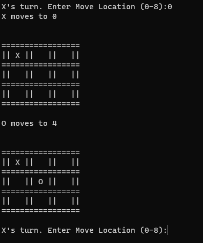

# NoxPy

## Description

The NoxPy Program uses a Minmax algorithm as a backtracking decision maker that optimises selected moves against the computer player. This works by minimizing the opponent's score which makes the player less likely to win. 

## Sources

Code was adapted from the tutorial by Ying, K:

https://youtu.be/fT3YWCKvuQE

Her Source code can be found here:

https://github.com/kying18/tic-tac-toe

### Features:
- Grid Play Area
- Allows user option selection
- human vs human
- human vs computer
- computer vs computer

[Back to Top](#NoxPy)
